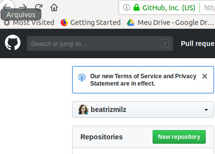

class: split-two with-border
.column.bg-main1[.content[
  # Sobre mim
<center>  </center>
]]
.column.bg-main2[.content[
  - Beatriz Milz, 25 anos, Diadema.<br><br>
- Bacharel em Gestão Ambiental (EACH/USP). <br><br>
- Mestre em Ciências no PPG-Análise Ambiental Integrada (UNIFESP/Diadema). <br><br>
- Atualmente candidata ao Doutorado em Ciência Ambiental no PROCAM/IEE/USP. <br><br>
- Aprendendo R desde agosto de 2018.<br><br>
- Participa da comunidade R-Ladies São Paulo desde agosto de 2018.<br><br>

- Email:<a href="mailto:beatriz.milz@hotmail.com"><i class="fas fa-envelope-square"></i>&nbsp; beatriz.milz@hotmail.com</a><br><br>

- Página: https://beatrizmilz.github.io/


- Github:<a href="http://github.com/beatrizmilz"><i class="fab fa-github"></i>&nbsp; @beatrizmilz</a> (repositório de código)<br><br>

- Twitter: @BeaMilz

]]


---
class: inverse, center, middle
# Comunicando seus resultados: criando apresentações com R

1) Introdução sobre a linguagem de marcação markdown e sobre arquivos do tipo RMarkdown.

2) Prática sobre como criar uma apresentação utilizando o pacote Xaringan. 

3) Hospedagem da apresentação utilizando o Github Pages.
---
class: inverse, middle

# Por que apresentações são importantes? 
<br>
<br>

<center>

</center>


Fonte: http://r4ds.had.co.nz/

- Uma das formas de comunicar os resultados!


- Hoje iremos praticar como criar uma apresentação utilizando o R e o pacote Xaringan. 


---
class: inverse, middle

# Pré-requisitos:
- [R](https://www.r-project.org/)
- [RStudio](https://www.rstudio.com/)
- Pacote [Rmarkdown](https://rmarkdown.rstudio.com/) * O R instala esse pacote automaticamente quando necessário.
- Pacote [Xaringan](https://github.com/yihui/xaringan) 
- Pacote [knitr](http://yihui.name/knitr/)

---
#Introdução sobre o Xaringan

- O xaringan é um pacote do R para criar apresentações usando o  [remark.js](http://remarkjs.com) através do Rmarkdown.

<center></center>


- Mais sobre o xaringan:

    - [Apresentação da documentação](http://slides.yihui.name/xaringan/) 
    - [Livro R Markdown (Capítulo 7)](https://bookdown.org/yihui/rmarkdown/xaringan.html)
    - [Remark.js Wiki](https://github.com/gnab/remark/wiki)
    - [Xaringan Wiki](https://github.com/yihui/xaringan/wiki)
---
# Instalar o Xaringan
- Existem duas formas de instalar:

CRAN:
```{r eval=FALSE, include=TRUE}
install.packages("xaringan")
```


Github:
```{r eval=FALSE, include=TRUE}
devtools::install_github("yihui/xaringan")
```


---


class: split-70 hide-slide-number
background-image: url("")
background-size: cover

.column.slide-in-left[
.sliderbox.vmiddle.shade_main.center[
.font5[RMarkdown]]]
.column[
]
---

## Rmarkdown
* É um tipo de arquivo que suporta códigos em R, texto, markdown e outros formatos.

* Apresenta os seus códigos, o resultado, e também os seus comentários.

* Arquivos **.Rmd** são reprodutíveis.

* São interessantes para trabalhar em equipe, para comunicar seus resultados, e para desenvolver seus códigos em R.

* O markdown é uma linguagem de marcação simples. 

* [Rmarkdown Cheatsheet](http://www.rstudio.com/wp-content/uploads/2016/03/rmarkdown-cheatsheet-2.0.pdf)

---
## Rmarkdown
* Possibilita exportar diferentes tipos de arquivos.
<br>
<center></center>

---
class: inverse, center, middle

# Inicie o RSTUDIO:
<center>

</center>
- Instale os pacotes:
```{r eval=FALSE, include=TRUE}

install.packages("rmarkdown")
install.packages("knitr")
install.packages("xaringan")

```

---
class: inverse, center, middle

# Crie um novo arquivo Rmarkdown:
<center>

</center>

---
class: inverse, center, middle

# Selecione o template Ninja Presentation:
<center>

</center>

* Dica: para facilitar posteriormente, crie a sua apresentação com o nome de `index.Rmd`.

---
class: inverse, center, middle

# Será criado um RMarkdown com o Ninja Presentation:
<center>

</center>

---
class: inverse, middle

# yaml - metadados do documento:
- **y**et **a**nother **m**arkup **l**anguage 
- Controla muitas das configurações do documento.
<center>

</center>
- title: título
- subtitle: subtítulo
- author: autor
- date: data
- output: formato (Ex: html_document, pdf_document, etc). No caso do Xaringan, o output é **xaringan::moon_reader**  
- Cuidado com a **identação**


Leia também: [Output Formats - R Markdown: The Definitive Guide](https://bookdown.org/yihui/rmarkdown/output-formats.html)

---
class: inverse, middle


# Quais são os temas disponíveis?

```{r}
names(xaringan:::list_css())
```

Alguns exemplos de disponíveis: [xaringan themes](https://github.com/yihui/xaringan/wiki/Themes)
---
class: inverse, middle
# Colocar o tema RLadies
```{r  eval=FALSE, include=TRUE}
output:
  xaringan::moon_reader:
    css: ["rladies", "rladies-fonts"]
```
- Criado por/Made by: [ALison Presmanes Hill](https://alison.rbind.io/post/r-ladies-slides/)
* Se você entende de CSS, é possível adaptar os temas e também criá-los :)
---
class: inverse, center, middle

# Exemplo do yaml:
<center>

</center>

- Aperte o Knit e...
---
class: inverse, center, middle

# Resultado:
<center>


</center>

- O knit exportará um arquivo do tipo html.
- Agora o tema da apresentação está configurado!
- Aperte H ou ? para conferir a lista de atalhos do sharingan. 
---
# DEU ERRO NO KNITR!

Calma! É bem comum dar erro ao compliar o arquivo pois **qualquer** código errado causa isso. Algumas coisas pra se observar:

- Yaml header - se algo estiver errado, vai dar erro ao compilar. Muito cuidado com a identação!

- Código nos chunks - teste o Run All Chunks e ver se dá erro em algum específico. Se descobrir, tente verificar o que há de errado no código (pode ser a falta de um parênteses, vírgula, entre outros).
---


class: split-70 hide-slide-number
background-image: url("")
background-size: cover

.column.slide-in-left[
.sliderbox.vmiddle.shade_main.center[
.font5[Markdown]]]
.column[
]

---
class: inverse, center, middle

# Markdown
* O markdown é uma linguagem de marcação simples. 
* [Rmarkdown Cheatsheet](http://www.rstudio.com/wp-content/uploads/2016/03/rmarkdown-cheatsheet-2.0.pdf)
* Elaborada para ser fácil de ler, fácil de escrever.


---
#Sintaxe Markdown
**Adicionar títulos**

```{r eval=FALSE, include=TRUE}
# Título 1
## Título 2
### Título 3

```
# Título 1
## Título 2
### Título 3


* [Rmarkdown Cheatsheet](http://www.rstudio.com/wp-content/uploads/2016/03/rmarkdown-cheatsheet-2.0.pdf)
---
- **Inserir imagens**
```{r eval=FALSE, message=FALSE, warning=FALSE, include=TRUE}

#    

```


* [Rmarkdown Cheatsheet](http://www.rstudio.com/wp-content/uploads/2016/03/rmarkdown-cheatsheet-2.0.pdf)
---
- **Formatar textos**
```{r eval=FALSE, include=TRUE}
Negrito: **colocar o texto entre dois asteriscos**.

Itálico: *colocar o texto entre astericos*.

Riscado: ~~colocar o texto entre dois tis ~~
```

Itálico: *colocar o texto entre astericos*.

Negrito: **colocar o texto entre dois asteriscos**.

Riscado: ~~colocar o texto entre dois tis~~

- **Criar links**

```{r eval=FALSE, include=TRUE}
[R](https://www.r-project.org/)
```

[R](https://www.r-project.org/)

* [Rmarkdown Cheatsheet](http://www.rstudio.com/wp-content/uploads/2016/03/rmarkdown-cheatsheet-2.0.pdf)
---
- **Adicionar campos de código**
```{r eval=FALSE, include=TRUE}
 `escreva um código aqui`
```

`escreva um código aqui`

- *Fórmulas**

```{r eval=FALSE, include=TRUE}

$A = \pi*r^{2}$
```

$A = \pi*r^{2}$

---
class: inverse, center, middle


#Elaborando a apresentação

## E explorando a cheatsheet
---
class: inverse, center, middle
# Quebra de slides
```{r eval=FALSE, include=TRUE}

---

```


---

class: inverse, center, middle

#Adicionando campos de código - chunks
<center>

</center>
- Aceita código em R, Python, SQL.

Dica: Atalho para criar chunk: `Ctrl + ALt + I`.
---
# Campos de código - chunks

- Crie um chunk para cada tarefa que for executar no R.

- O chunk tem várias opções interessantes referentes ao documento gerado:

    - `eval = FALSE` - Apresenta o código mas não "roda" ele. É útil para quando queremos apenas mostrar o código.
    
    - `include = FALSE`- "roda" o código, porém não mostra o código e nem o resultado no documento final. Ex: `library(tidyverse)` em apresentações que não apresentam os códigos.
    
    - `echo = FALSE` - não apresenta o código, mas apresenta o resultado. 
    
    - `message = FALSE` e `warning = FALSE` - não mostra as mensagens de erro e warning no arquivo gerado.
    
    - `cache = TRUE` - mantém uma cópia do resultado do seu código no computador. É prático para usar quando o código 

Consulta: [KnitR Options](https://yihui.name/knitr/options/)

---

class: inverse, center, middle

#Adicionando campos de código - chunks
** Exemplo: Adicionar um gráfico**
<center>

</center>

Dica de atalho: Ctrl-Shift-Enter - O Rstudio executa o código e disponibiliza os resultados abaixo do código.

---
#Adicionando código R fora do chunk 
```{r eval=FALSE, include=TRUE}
`r `
```

Exemplo:
```{r eval=FALSE, include=TRUE}
# O banco de dados mtcars possui `r nrow(mtcars)` carros cadastrados. 
```

Exemplo: O banco de dados mtcars possui `r nrow(mtcars)` carros cadastrados. 

* Útil para relatórios!

---
** Exemplo: Adicionar um gráfico**
```{r}
attach(mtcars)
plot(wt, mpg, main="Scatterplot Example",
xlab="Car Weight ", ylab="Miles Per Gallon ", pch=19)
```


---
** Exemplo: Adicionar uma tabela**

```{r }
head(mtcars)
```


---
** Exemplo: Adicionar uma tabela**
```{r}
DT::datatable(head(mtcars, 10),
  fillContainer = FALSE, options = list(pageLength = 5))
```

---
# Exercício

1. Crie um arquivo Rmarkdown do tipo *presentation ninja*;
1. Aplique o estilo R-ladies;
1. Altere dados de autor, dê um título para o slide.
1. Usando a cheatsheet, use sua imaginação: adicione títulos, textos, imagens, links, etc.
1. Usando os chunks (campos de código), teste como ele funciona, e use algum código nele (gráfico, tabela, função, etc).
1. Exporte a apresentação usando o Knitr.
1. Abra o arquivo da sua apresentação em um navegador.
1. Aprecie sua apresentação feita no R :D

- ** A melhor forma de aprender é ir testando!**
---

# Compartilhando a apresentação 

## Salvar em PDF 
Usando o navegador Chrome, imprima para arquivo (Ctrl + P). Não dá certo com o Mozzila Firefox :(. 
* https://github.com/yihui/xaringan/wiki/Export-Slides-to-PDF

## Salvar em HTML
- O formato que utilizamos para exportar uma apresentação elaborada com o xaringan é **.html**. Para isso, é necessário apertar o botão Knit (mostrado anteriormente).
- É possível hospedar o seu arquivo de apresentação em sites como o [Github Pages](https://github.com/) e [Netlify](https://www.netlify.com/).
---
# Compartilhando a apresentação via Github Pages

1) Crie uma conta gratuita no github: https://github.com/

2) Na sua conta do github, crie um novo repositório (New repository)

<center>

</center>

* OBS: [Esse post do @w_oliveiras](https://medium.com/trainingcenter/plano-para-estudar-git-e-github-enquanto-aprende-programa%C3%A7%C3%A3o-f5d5f986f459) é sobre como usar git e github e pode ajudar! 

---
# Compartilhando a apresentação via Github Pages
3) Coloque um nome e descrição no novo repositório. Deixe como público. 

<center>

</center>

---
# Compartilhando a apresentação via Github Pages
4) Repositório criado! 

<center>

</center>

---
# Compartilhando a apresentação via Github Pages
5) Githubpages e pasta DOCS.

- Para o github pages funcionar, você precisa adicionar o conteúdo em uma pasta chamada `docs`. Então, antes de fazer upload, no seu computador/workingdirectory/projeto, crie uma pasta com o nome `docs` e coloque todos os arquivos da sua apresentação nessa pasta.

- De preferência, a sua apresentação deve se chamar index.html (após compilado).

<center>

</center>
---
# Compartilhando a apresentação via Github Pages
- Área de upload do seu repositório do github (essa não é a única forma de realizar upload, também é possível através do github desktop e pelo terminal de comando).


<center>

</center>

---
# Compartilhando a apresentação via Github Pages
6) Faça o upload da pasta docs INTEIRA no seu repositório do github. 

<center>

</center>

---
# Compartilhando a apresentação via Github Pages
7) Coloque uma mensagem no commit, para deixar registrado que alteração foi feita.

<center>

</center>
---
# Compartilhando a apresentação via Github Pages
8) No seu repositório, clique em Settings...
<center>

</center>
---
# Compartilhando a apresentação via Github Pages
8) ... e na seção Github Pages, selecione **master brach /docs folder**:.
<center>

</center>

<center> <strong>Resultado</strong>: <a href="https://beatrizmilz.github.io/teste/">https://beatrizmilz.github.io/teste/</a> </center> 

---
# Referências

* [R for Data Science - Hadley Wickham & Garret Grolemund](https://r4ds.had.co.nz/) - Gratuito, em inglês.
* **Xaringan**
    + [Xaringan no Github](https://github.com/yihui/xaringan)
    + [Documentação](https://slides.yihui.name/xaringan/)
* **Themes**:
* Rladies:
    + [ALison Presmanes Hill](https://alison.rbind.io/post/r-ladies-slides/)
* Kunoichi:
    + [Documentação Kunoichi](https://emitanaka.github.io/ninja-theme/themes/kunoichi/kunoichi-theme-example.html)
    + [Kunoichi no Github](https://github.com/emitanaka/ninja-theme)
    + [Emi Tanaka](https://twitter.com/statsgen)!


- Material de estudo:
    + [R Markdown: The Definitive Guide](https://bookdown.org/yihui/rmarkdown/)

- Thanks!

---
class: inverse, center, middle

# Obrigada!
Apresentação elaborada com [Xaringan](https://github.com/yihui/xaringan) e [Kunoichi](https://github.com/emitanaka/ninja-theme)

<script src="remark-latest.min.js">
